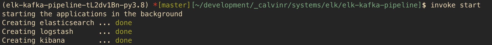

# Ansible Automation Example: Build VXLAN / EVPN Data Center

[](https://junos-ansible-modules.readthedocs.io/en/stable/)

## Overview

This example will show how to use concepts from "Infrastructure-as-Code" to build a full VXLAN/EVPN data center.

In addition to the Ansible playbok, this project also ships with additional tools to help you along your way. You will find a Dockerfile for running the project in an isolated environment, and a Makefile for those of us that hate typing out everything all the time.

## 📝 `Dependencies`

The project relies on Docker and Docker-Compose, the use of Invoke to make life easier is optional.

If you are unsure if Docker is installed on your computer, then it's probably safe to suggest that it's not. If you're interested in learning more about the product, I encourage you to read a few blogs on the topic. A personal recommendation would be [Digital Ocean](https://www.digitalocean.com/community/tutorial_collections/how-to-install-and-use-docker#:~:text=Docker%20is%20an%20application%20that,on%20the%20host%20operating%20system.)

Refer to the Poetry Lock file located at [poetry.lock](poetry.lock) for detailed descriptions on each Python package installed.

## 🚀 `Executing the playbook`

### With Invoke installed on your machine

If you have [invoke](https://pypi.org/project/invoke/) installed, you can use these two commands to build the container and run the playbook.

1. build the container images with

```bash
$ invoke build
```

2. run the applications

```bash
$ invoke start
```

3. (optional) monitor the logs

```bash
$ invoke logs
```

### Without Invoke installed on your system

1. build the container images

> this is a one-time task and won't need to be performed in subsequent playbook runs

```bash
$ docker-compose -f {docker_compose_file} -p elk build
```

2. start all the containers to run in the background

```bash
$ docker-compose -f {docker_compose_file} up -d"
```

3. (optional) watch the logs in realtime

```bash
$ docker-compose -f {docker_compose_file} logs -f"
```

## 🐍 `Your Python environment`

I have included a Poetry file for anyone saavy enough to take advantage. For the uninitiated, Poetry helps replicate Python environments between users with a single file. You'll need to have Poetry installed on your machine, for most users that will be solved with `pip install poetry`.

This is optional, as of this moment the only package installed by Poetry is Invoke, an optional python package used to help lazy people build shortcuts.

> install Python dependencies and activate virtualenvironment

```bash
$ poetry install
$ poetry shell
```

### 〰️ `Notes about Python Virtual Environments`

Similar to Docker, if you are unsure if you're using Python Virtual Environment features, it is safe to suggest that you're not. You are *strongly* recommended to using a Python Virtual Environment everywhere. You can really mess up your machine if you're too lazy and say "ehh, that seems like it's not important". It is. If it sounds like I'm speaking from experience, well I'll never admit to it.

If you're interested in learning more about setting up Virtual Environments, I encourage you to read a few blogs on the topic. A personal recommendation would be

- [Digital Ocean (macOS)](https://www.digitalocean.com/community/tutorials/how-to-install-python-3-and-set-up-a-local-programming-environment-on-macos)
- [Digital Ocean (Windows 10)](https://www.digitalocean.com/community/tutorials/how-to-install-python-3-and-set-up-a-local-programming-environment-on-windows-10)

## ⚙️ `How it works`

Docker-Compose will help us manage the lifecycles of multiple containers at once; below is list of the containers and links to their Dockerfile

Name | Description
---- | -----------
[logstash](files/docker/logstash/Dockerfile)|Logstash
[elasticsearch](files/docker/elasticsearch/Dockerfile)|Elasticsearch
[kibana](files/docker/kibana/Dockerfile)|Kibana

## 📸 `Screenshot`


